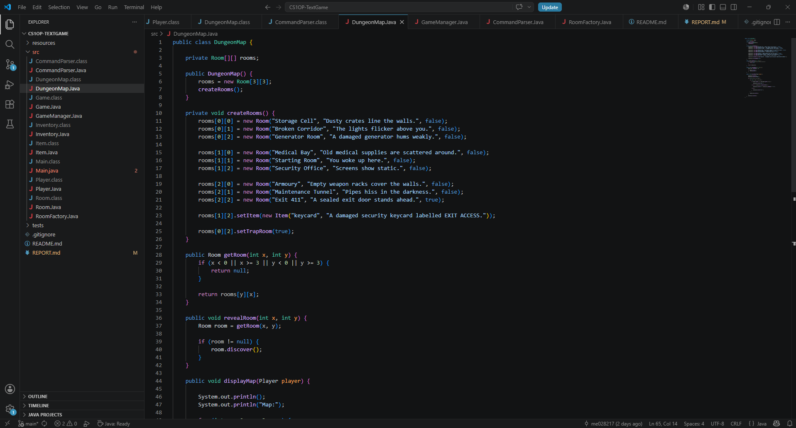
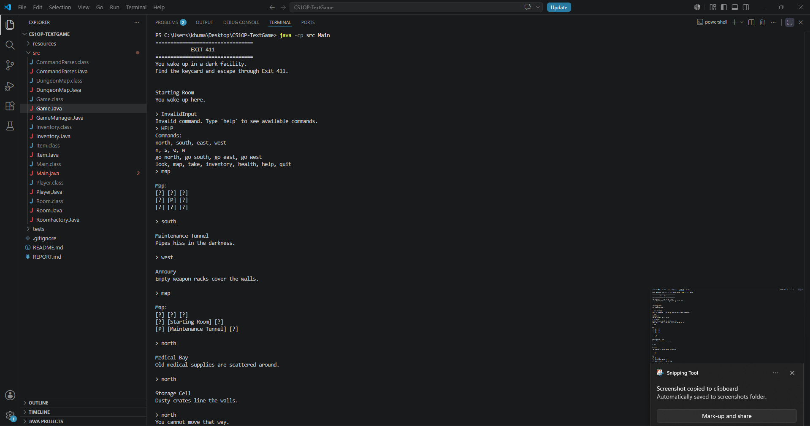
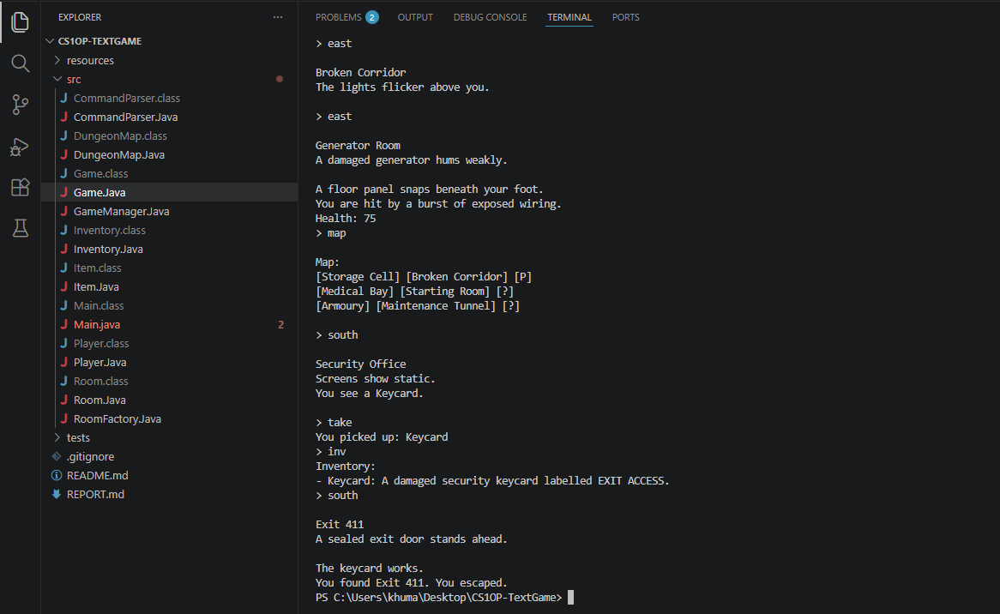

# EXIT 411

A Java-based text adventure game developed using **Object-Oriented Programming (OOP)** principles.

The player wakes up inside a dark abandoned facility and must explore interconnected rooms, survive hazards, locate a security keycard before escaping through **Exit 411**.

The project demonstrates object-oriented design, command parsing, inventory management, player state tracking and modular software architecture.

---

# Gameplay Demo

This project is a terminal-based Java application.

Gameplay screenshots demonstrating the main features can be found below.

---

# Screenshots

## Dungeon Map Code



Source code implementing the dungeon layout, room creation and map management.

---

## Gameplay



Gameplay demonstrating room exploration, player movement and the dynamic map discovery system.

---

## Successful Escape



Collect the security keycard, unlock Exit 411 and successfully escape the facility.

---

# Features

- Text-based command system
- 3×3 dungeon exploration
- Room discovery and map tracking
- Inventory system
- Collectable security keycard
- Locked exit puzzle
- Health and trap system
- Boundary checking
- Help and utility commands
- Modular Object-Oriented class structure

---

# Commands

| Command | Description |
|----------|-------------|
| `north`, `south`, `east`, `west` | Move between rooms |
| `n`, `s`, `e`, `w` | Short movement commands |
| `map` | Display discovered rooms |
| `take` | Pick up an item |
| `inventory` / `inv` | Display inventory |
| `health` | Display current health |
| `look` | Redisplay the current room description |
| `help` | Display available commands |
| `quit` | Exit the game |

---

# Gameplay Objective

The player must:

- Explore the abandoned facility
- Find the security keycard
- Reach Exit 411
- Escape successfully

Some rooms contain traps that reduce the player's health, encouraging careful exploration and strategic movement.

---

# Technologies

- Java
- Object-Oriented Programming (OOP)
- Visual Studio Code
- Git
- GitLab

---

# Project Structure

```text
CS10P-TextGame
├── resources
│   └── images
├── src
│   ├── Main.java
│   ├── Game.java
│   ├── Player.java
│   ├── Room.java
│   ├── DungeonMap.java
│   ├── Inventory.java
│   ├── Item.java
│   └── CommandParser.java
├── README.md
└── REPORT.md
```

---

# Skills Demonstrated

- Java Development
- Object-Oriented Programming
- Software Design
- Command Parsing
- State Management
- Inventory Management
- Collections & Data Structures
- Encapsulation
- Abstraction
- Modularity
- Debugging & Testing
- Version Control with Git

---

# Object-Oriented Programming Concepts

### Encapsulation

Classes manage their own private data through methods and getters.

Examples include:

- Player stores health, inventory and position.
- Room stores descriptions, discovery state and traps.

### Abstraction

Complex game behaviour is separated into reusable methods such as:

- `displayMap()`
- `handleCommand()`
- `movePlayer()`

### Modularity

Each class has a dedicated responsibility, making the project easier to maintain, test and extend.

---

# Testing

The game was tested using a variety of gameplay scenarios and edge cases.

| Feature | Result |
|----------|--------|
| Movement system | ✅ Passed |
| Boundary checking | ✅ Passed |
| Invalid command handling | ✅ Passed |
| Inventory system | ✅ Passed |
| Keycard pickup | ✅ Passed |
| Locked exit condition | ✅ Passed |
| Health and trap system | ✅ Passed |
| Map discovery system | ✅ Passed |

Testing confirmed that all major gameplay systems functioned as expected.

---

# Future Improvements

Potential future improvements include:

- Enemy AI using pathfinding algorithms
- Timed escape sequences
- Combat mechanics
- Procedural room generation
- Save/load functionality
- Graphical user interface
- Multiple endings
- Advanced puzzles and interactive objects

---

# Version Control

Git and GitLab were used throughout development to:

- Track project changes
- Manage development progress
- Maintain a complete development history
- Safely back up the project

---

# Compilation

Compile all Java source files:

```bash
javac src/*.java
```

If PowerShell wildcard expansion causes issues:

```bash
javac src/Main.java src/Game.java src/Player.java src/Room.java src/DungeonMap.java src/Inventory.java src/Item.java src/CommandParser.java
```

---

# Running the Project

```bash
java -cp src Main
```

---

# Author

**Khuma Sharneck**

Computer Science student at the University of Reading

Aspiring Software Engineer

GitHub: https://github.com/KhumaSharneck

LinkedIn: https://www.linkedin.com/in/khuma-sharneck-a47a3a2b1
